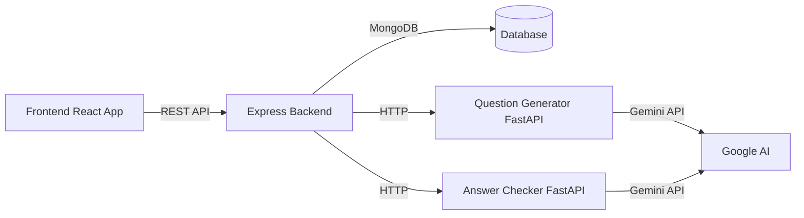

<div align="center">

# 📚 ExamZone

**A Comprehensive Exam Management Platform with AI-Powered Features**

[](https://reactjs.org/)
[](https://expressjs.com/)
[](https://www.mongodb.com/)
[](https://fastapi.tiangolo.com/)
[](https://www.typescriptlang.org/)
[](https://tailwindcss.com/)

ExamZone is a modern, full-stack examination management system that streamlines the entire exam lifecycle—from creation to evaluation—using cutting-edge AI technologies.

[Features](#-features) • [Installation](#%EF%B8%8F-installation) • [Usage](#-running-the-application) • [API Documentation](#-api-endpoints) • [Contributing](#-contributing)

</div>

---

## 📖 Table of Contents

- [Overview](#-overview)
- [Features](#-features)
- [Architecture](#%EF%B8%8F-architecture)
- [Tech Stack](#-tech-stack)
- [Prerequisites](#-prerequisites)
- [Installation](#%EF%B8%8F-installation)
- [Configuration](#-environment-variables)
- [Running the Application](#-running-the-application)
- [Project Structure](#-project-structure)
- [API Documentation](#-api-endpoints)
- [Development](#%EF%B8%8F-development)
- [Build for Production](#-build-for-production)
- [Known Issues](#-known-issues)
- [Contributing](#-contributing)
- [License](#-license)
- [Support](#-support)

---

## 🌟 Overview

ExamZone revolutionizes traditional examination systems by combining robust classroom management with AI-powered automation. Teachers can create personalized question papers for each student, automatically evaluate answer sheets, and manage entire classes—all through an intuitive web interface.

### Key Highlights

- 🤖 **AI-Powered Question Generation** using Google Gemini
- 📝 **Automated Answer Evaluation** with OCR and AI analysis
- 👥 **Multi-Role Support** for teachers and students
- 📄 **Bulk PDF Generation** for individualized exam papers
- 🔐 **Secure Authentication** with JWT tokens
- 📊 **Real-time Analytics** and progress tracking

## 🏗️ Architecture

ExamZone follows a **microservices architecture** with clear separation of concerns:

```
ExamZone/
├── backend/                    # Node.js/Express REST API (Port 3000)
│   ├── controllers/            # Business logic handlers
│   ├── models/                 # MongoDB schemas
│   ├── routes/                 # API route definitions
│   ├── services/               # External service integrations
│   ├── middleware/             # Auth, validation, error handling
│   └── utils/                  # Helper functions
│
├── frontend/                   # React + TypeScript SPA (Port 5173)
│   ├── src/
│   │   ├── pages/              # Route-level components
│   │   ├── components/         # Reusable UI components
│   │   ├── api/                # API client functions
│   │   ├── contexts/           # React Context providers
│   │   └── utils/              # Helper functions
│   └── public/                 # Static assets
│
├── ai-services/
│   ├── question-generator/     # FastAPI service (Port 8000)
│   │   ├── main.py             # Question paper generation
│   │   └── templates/          # PDF templates
│   └── answer-checker/         # FastAPI service (Port 7000)
│       ├── main.py             # Answer evaluation & OCR
│       └── templates/          # Evaluation templates
│
├── pdfs/                       # Generated question papers
├── uploads/                    # Student lists & exam files
├── answersheets/               # Uploaded answer sheets
└── storage/                    # Persistent file storage
```

### Communication Flow



## 🚀 Tech Stack

### Backend Stack
| Technology | Version | Purpose |
|------------|---------|---------|
| **Express.js** | 5.1.0 | Web application framework |
| **MongoDB** | - | NoSQL database |
| **Mongoose** | 8.13.2 | MongoDB ODM |
| **JWT** | 9.0.3 | Authentication & authorization |
| **Bcrypt** | 3.0.3 | Password hashing |
| **Multer** | 1.4.5 | File upload handling |
| **PDFKit** | 0.17.2 | PDF generation |
| **Winston** | 3.19.0 | Logging |
| **Helmet** | 8.1.0 | Security headers |

### Frontend Stack
| Technology | Version | Purpose |
|------------|---------|---------|
| **React** | 19.2.0 | UI library |
| **TypeScript** | 5.9.3 | Type-safe JavaScript |
| **Vite** | 7.2.5 | Build tool & dev server |
| **Tailwind CSS** | 4.1.18 | Utility-first CSS framework |
| **React Router** | 7.12.0 | Client-side routing |
| **Axios** | 1.13.2 | HTTP client |
| **Lucide React** | 0.562.0 | Icon library |

### AI Services Stack
| Technology | Purpose |
|------------|---------|
| **FastAPI** | Python web framework for AI services |
| **Google Gemini API** | Natural language processing & generation |
| **Tesseract OCR** | Text extraction from images |
| **pdfplumber** | PDF text extraction |
| **ReportLab** | PDF generation in Python |
| **Pillow** | Image processing |

## 📋 Prerequisites

Before you begin, ensure you have the following installed on your system:

- **Node.js** (v18.0.0 or higher) - [Download](https://nodejs.org/)
- **Python** (3.8 or higher) - [Download](https://www.python.org/downloads/)
- **MongoDB** (v5.0 or higher) - [Download](https://www.mongodb.com/try/download/community)
- **npm** or **yarn** - Package manager (comes with Node.js)
- **pip** - Python package manager (comes with Python)

### Required API Keys

- **Google Gemini API Key** - [Get it here](https://makersuite.google.com/app/apikey)
  - Required for AI-powered question generation and answer evaluation

### Optional Tools

- **MongoDB Compass** - GUI for MongoDB (recommended for beginners)
- **Postman** - API testing tool
- **VS Code** - Recommended code editor with extensions:
  - ESLint
  - Prettier
  - Python
  - Tailwind CSS IntelliSense

## ⚙️ Installation

Follow these steps to set up ExamZone on your local machine:

### 1️⃣ Clone the Repository

```bash
git clone https://github.com/source-rashi/ExamZone.git
cd ExamZone
```

### 2️⃣ Backend Setup

```bash
# Navigate to backend directory
cd backend

# Install dependencies
npm install

# Create environment file
cp .env.example .env

# Edit .env with your configuration
# - Set MongoDB connection string
# - Add session secret
# - Configure Gemini API key
```

**Backend `.env` Configuration:**
```env
PORT=3000
MONGODB_URI=mongodb://localhost:27017/classDB
SESSION_SECRET=your-super-secret-session-key-change-this
FASTAPI_BASE_URL=http://127.0.0.1:8000
FASTAPI_AI_URL=http://127.0.0.1:8000
GOOGLE_API_KEY=your-gemini-api-key-here
JWT_SECRET=your-jwt-secret-key
NODE_ENV=development
```

### 3️⃣ Frontend Setup

```bash
# Navigate to frontend directory (from project root)
cd frontend

# Install dependencies
npm install

# Create environment file
cp .env.example .env

# Edit .env to set backend URL
```

**Frontend `.env` Configuration:**
```env
VITE_API_BASE_URL=http://localhost:3000
```

### 4️⃣ AI Services Setup

#### Question Generator Service

```bash
# Navigate to question-generator directory (from project root)
cd ai-services/question-generator

# Create virtual environment (recommended)
python -m venv venv

# Activate virtual environment
# On Windows:
venv\Scripts\activate
# On macOS/Linux:
source venv/bin/activate

# Install dependencies
pip install -r requirements.txt

# Create environment file
echo GOOGLE_API_KEY=your-gemini-api-key-here > .env
```

#### Answer Checker Service

```bash
# Navigate to answer-checker directory (from project root)
cd ai-services/answer-checker

# Create virtual environment (recommended)
python -m venv venv

# Activate virtual environment
# On Windows:
venv\Scripts\activate
# On macOS/Linux:
source venv/bin/activate

# Install dependencies
pip install -r requirements.txt

# Install Tesseract OCR
# Windows: Download from https://github.com/UB-Mannheim/tesseract/wiki
# macOS: brew install tesseract
# Ubuntu: sudo apt-get install tesseract-ocr

# Create environment file
echo GEMINI_API_KEY=your-gemini-api-key-here > .env
```

### 5️⃣ Database Setup

```bash
# Start MongoDB service
# Windows (if installed as service):
net start MongoDB

# macOS (if installed via Homebrew):
brew services start mongodb-community

# Linux:
sudo systemctl start mongod

# Or run MongoDB directly:
mongod --dbpath /path/to/your/data/directory
```

## 🏃 Running the Application

ExamZone requires **5 concurrent processes**. Open 5 terminal windows and run the following commands:

### Terminal 1: MongoDB Database 💾

```bash
# Start MongoDB (if not running as a service)
mongod

# Default port: 27017
```

### Terminal 2: Backend Server 🖥️

```bash
cd backend
npm start

# Server running at: http://localhost:3000
# API Documentation: http://localhost:3000/api
```

### Terminal 3: Question Generator Service 🤖

```bash
cd ai-services/question-generator

# Activate virtual environment first (if created)
# Windows: venv\Scripts\activate
# macOS/Linux: source venv/bin/activate

uvicorn main:app --reload --port 8000

# Service running at: http://localhost:8000
# API docs: http://localhost:8000/docs
```

### Terminal 4: Answer Checker Service 📝

```bash
cd ai-services/answer-checker

# Activate virtual environment first (if created)
# Windows: venv\Scripts\activate
# macOS/Linux: source venv/bin/activate

uvicorn main:app --reload --port 7000

# Service running at: http://localhost:7000
# API docs: http://localhost:7000/docs
```

### Terminal 5: Frontend Development Server ⚛️

```bash
cd frontend
npm run dev

# Application running at: http://localhost:5173
```

### 🎉 Access the Application

Once all services are running, open your browser and navigate to:

**Frontend**: [http://localhost:5173](http://localhost:5173)

> **Note**: Ensure all 5 services are running simultaneously for full functionality.

### Quick Start Scripts (Optional)

You can create a startup script to run all services at once:

**Windows (PowerShell) - `start-all.ps1`:**
```powershell
Start-Process powershell -ArgumentList "-NoExit", "-Command", "cd backend; npm start"
Start-Process powershell -ArgumentList "-NoExit", "-Command", "cd ai-services/question-generator; venv\Scripts\activate; uvicorn main:app --reload --port 8000"
Start-Process powershell -ArgumentList "-NoExit", "-Command", "cd ai-services/answer-checker; venv\Scripts\activate; uvicorn main:app --reload --port 7000"
Start-Process powershell -ArgumentList "-NoExit", "-Command", "cd frontend; npm run dev"
```

**Unix/Linux/macOS - `start-all.sh`:**
```bash
#!/bin/bash
cd backend && npm start &
cd ai-services/question-generator && source venv/bin/activate && uvicorn main:app --reload --port 8000 &
cd ai-services/answer-checker && source venv/bin/activate && uvicorn main:app --reload --port 7000 &
cd frontend && npm run dev &
wait
```

## 🎯 Features

### 👨‍🏫 Teacher Dashboard

#### Class Management
- ✅ Create and manage multiple classes
- ✅ Upload student lists via PDF with automatic parsing
- ✅ Invite students via email or shareable links
- ✅ Track student enrollment and participation
- ✅ Post announcements to entire class

#### Exam Creation & Management
- ✅ Upload question banks (PDF/DOCX format)
- ✅ **AI-Powered Question Paper Generation**
  - Automatic question shuffling per student
  - Personalized papers to prevent cheating
  - Bulk PDF generation for entire class
  - Download individual papers or ZIP archive
- ✅ Set exam duration, total marks, and passing criteria
- ✅ Schedule exams with start/end times
- ✅ Real-time exam monitoring

#### Assignment Management
- ✅ Create assignments with deadlines
- ✅ Upload assignment files and resources
- ✅ Track submission status
- ✅ Grade submissions with feedback

#### Answer Sheet Evaluation
- ✅ **AI-Powered Answer Checking**
  - OCR-based text extraction from handwritten/typed answers
  - Intelligent answer evaluation using Google Gemini
  - Automated grading with customizable rubrics
  - Detailed feedback generation for each answer
- ✅ Manual grade override capability
- ✅ Bulk evaluation support
- ✅ Export results to CSV/PDF

#### Analytics & Reporting
- ✅ Class performance statistics
- ✅ Individual student progress tracking
- ✅ Exam difficulty analysis
- ✅ Grade distribution charts

### 👨‍🎓 Student Dashboard

#### Class Participation
- ✅ Join classes via invitation codes
- ✅ View class materials and announcements
- ✅ Access course syllabus and schedule

#### Exam Taking
- ✅ View upcoming and past exams
- ✅ Download personalized question papers
- ✅ Submit answer sheets (PDF/image format)
- ✅ Receive instant notifications on evaluation
- ✅ View detailed feedback and grades

#### Assignment Submission
- ✅ View assignment details and deadlines
- ✅ Upload submission files
- ✅ Track submission status
- ✅ Receive grades and teacher feedback

#### Performance Tracking
- ✅ View grades for all exams and assignments
- ✅ Track overall progress in each class
- ✅ Identify areas for improvement
- ✅ Download grade reports

### 🤖 AI-Powered Features

#### 1. Question Paper Generation
- **Smart Question Selection**: AI analyzes question bank and creates balanced papers
- **Automatic Shuffling**: Each student gets a unique paper with same difficulty
- **PDF Generation**: Professional, print-ready question papers
- **Bulk Processing**: Generate papers for entire class in minutes
- **Customization**: Control question types, marks distribution, and difficulty

#### 2. Answer Sheet Evaluation
- **OCR Technology**: Extract text from handwritten or typed answer sheets
- **AI Evaluation**: Google Gemini analyzes answers against model solutions
- **Intelligent Scoring**: Considers partial credit and alternative correct answers
- **Feedback Generation**: Detailed explanations for marks awarded/deducted
- **Plagiarism Detection**: Identify similar answers across submissions

### 🔐 Security Features

- ✅ JWT-based authentication
- ✅ Bcrypt password hashing
- ✅ Role-based access control (Teacher/Student)
- ✅ Session management
- ✅ Rate limiting on API endpoints
- ✅ Secure file upload with validation
- ✅ CORS protection
- ✅ Helmet.js security headers

## 📁 Project Structure

### Backend Directory Structure

```
backend/
├── app.js                      # Express app configuration
├── server.js                   # Application entry point
├── package.json                # Dependencies and scripts
│
├── config/
│   ├── db.js                   # MongoDB connection setup
│   ├── logger.js               # Winston logger configuration
│   └── upload.config.js        # Multer file upload settings
│
├── controllers/                # Request handlers
│   ├── auth.controller.js      # Authentication logic
│   ├── class.controller.js     # Class management
│   ├── exam.controller.js      # Exam operations
│   ├── exam.controller.v2.js   # Enhanced exam features
│   ├── assignment.controller.js
│   ├── evaluation.controller.js
│   └── ...
│
├── models/                     # MongoDB schemas
│   ├── User.js                 # User model (Teacher/Student)
│   ├── Class.js                # Class model
│   ├── Exam.js                 # Exam model
│   ├── Assignment.js           # Assignment model
│   ├── Attempt.js              # Exam attempt model
│   ├── Evaluation.js           # Answer evaluation model
│   └── ...
│
├── routes/                     # API route definitions
│   ├── auth.routes.js          # /api/auth/*
│   ├── class.routes.js         # /api/classes/*
│   ├── exam.routes.js          # /api/exams/*
│   ├── assignment.routes.js    # /api/assignments/*
│   └── ...
│
├── middleware/
│   ├── auth.middleware.js      # JWT verification
│   ├── role.middleware.js      # Role-based access control
│   ├── validate.middleware.js  # Request validation
│   ├── error.middleware.js     # Error handling
│   └── rateLimit.middleware.js # Rate limiting
│
├── services/                   # External service integrations
│   ├── ai.service.js           # Gemini API integration
│   ├── pdf.service.js          # PDF generation
│   └── email.service.js        # Email notifications
│
└── utils/                      # Helper functions
    ├── validators.js           # Input validation
    ├── helpers.js              # Utility functions
    └── constants.js            # Application constants
```

### Frontend Directory Structure

```
frontend/
├── src/
│   ├── main.tsx                # Application entry point
│   ├── App.tsx                 # Root component
│   ├── index.css               # Global styles
│   │
│   ├── pages/                  # Route-level components
│   │   ├── Home.tsx            # Landing page
│   │   ├── Login.tsx           # Login page
│   │   ├── Register.tsx        # Registration page
│   │   ├── Dashboard.tsx       # Main dashboard
│   │   ├── ClassDetails.tsx    # Class view
│   │   ├── ExamView.tsx        # Exam interface
│   │   └── ...
│   │
│   ├── components/             # Reusable UI components
│   │   ├── Navbar.tsx          # Navigation bar
│   │   ├── Sidebar.tsx         # Side navigation
│   │   ├── ClassCard.tsx       # Class display card
│   │   ├── ExamCard.tsx        # Exam display card
│   │   ├── Modal.tsx           # Modal component
│   │   └── ...
│   │
│   ├── contexts/               # React Context providers
│   │   ├── AuthContext.tsx     # Authentication state
│   │   └── ThemeContext.tsx    # Theme management
│   │
│   ├── api/                    # API client functions
│   │   ├── auth.api.ts         # Authentication APIs
│   │   ├── class.api.ts        # Class management APIs
│   │   ├── exam.api.ts         # Exam APIs
│   │   └── ...
│   │
│   ├── hooks/                  # Custom React hooks
│   │   ├── useAuth.ts          # Authentication hook
│   │   └── useApi.ts           # API call hook
│   │
│   ├── types/                  # TypeScript type definitions
│   │   ├── user.types.ts
│   │   ├── class.types.ts
│   │   └── exam.types.ts
│   │
│   └── utils/                  # Helper functions
│       ├── formatters.ts       # Data formatting
│       └── validators.ts       # Form validation
│
├── public/                     # Static assets
│   ├── logo.svg
│   └── favicon.ico
│
└── Configuration Files
    ├── vite.config.ts          # Vite configuration
    ├── tsconfig.json           # TypeScript configuration
    ├── tailwind.config.js      # Tailwind CSS configuration
    └── postcss.config.js       # PostCSS configuration
```

### AI Services Directory Structure

```
ai-services/
│
├── question-generator/
│   ├── main.py                 # FastAPI application
│   ├── requirements.txt        # Python dependencies
│   ├── .env                    # Environment variables
│   ├── static/                 # Static files
│   └── templates/              # HTML templates
│
└── answer-checker/
    ├── main.py                 # FastAPI application
    ├── requirements.txt        # Python dependencies
    ├── .env                    # Environment variables
    ├── static/                 # Static files
    └── templates/              # HTML templates
```

## 🔒 Environment Variables

### Backend Configuration (`backend/.env`)

```env
# Server Configuration
PORT=3000
NODE_ENV=development

# Database
MONGODB_URI=mongodb://localhost:27017/classDB

# Authentication
SESSION_SECRET=your-super-secret-session-key-change-this-to-random-string
JWT_SECRET=your-jwt-secret-key-change-this-to-random-string
JWT_EXPIRE=7d

# AI Services
FASTAPI_BASE_URL=http://127.0.0.1:8000
FASTAPI_AI_URL=http://127.0.0.1:8000
GOOGLE_API_KEY=your-gemini-api-key-here

# Email Configuration (Optional)
SMTP_HOST=smtp.gmail.com
SMTP_PORT=587
SMTP_USER=your-email@gmail.com
SMTP_PASS=your-app-password

# File Upload
MAX_FILE_SIZE=10485760  # 10MB in bytes
ALLOWED_FILE_TYPES=pdf,doc,docx,jpg,jpeg,png

# Rate Limiting
RATE_LIMIT_WINDOW=15    # minutes
RATE_LIMIT_MAX=100      # requests per window

# CORS
CORS_ORIGIN=http://localhost:5173
```

### Frontend Configuration (`frontend/.env`)

```env
# API Configuration
VITE_API_BASE_URL=http://localhost:3000

# Google OAuth (Optional)
VITE_GOOGLE_CLIENT_ID=your-google-oauth-client-id

# Application Configuration
VITE_APP_NAME=ExamZone
VITE_APP_VERSION=1.0.0
```

### Question Generator Service (`ai-services/question-generator/.env`)

```env
# Google AI Configuration
GOOGLE_API_KEY=your-gemini-api-key-here

# Service Configuration
HOST=0.0.0.0
PORT=8000
WORKERS=1

# Logging
LOG_LEVEL=info
```

### Answer Checker Service (`ai-services/answer-checker/.env`)

```env
# Google AI Configuration
GEMINI_API_KEY=your-gemini-api-key-here

# OCR Configuration
TESSERACT_PATH=/usr/bin/tesseract  # Adjust based on your OS
OCR_LANGUAGE=eng

# Service Configuration
HOST=0.0.0.0
PORT=7000
WORKERS=1

# Logging
LOG_LEVEL=info
```

### 🔑 How to Get API Keys

#### Google Gemini API Key
1. Visit [Google AI Studio](https://makersuite.google.com/app/apikey)
2. Sign in with your Google account
3. Click "Create API Key"
4. Copy the key and add it to your `.env` files

> **⚠️ Security Warning**: Never commit `.env` files to version control. Always add them to `.gitignore`.

## 🛠️ Development

### Backend Development

```bash
cd backend

# Install dependencies
npm install

# Run in development mode with auto-reload
npm run dev  # Uses nodemon

# Run linter
npm run lint

# Run tests
npm test
```

### Frontend Development

```bash
cd frontend

# Install dependencies
npm install

# Start development server with hot reload
npm run dev

# Run type checking
npm run type-check

# Run linter
npm run lint

# Fix linting issues automatically
npm run lint:fix
```

### AI Services Development

```bash
# Question Generator
cd ai-services/question-generator
source venv/bin/activate  # or venv\Scripts\activate on Windows
uvicorn main:app --reload --port 8000

# Answer Checker
cd ai-services/answer-checker
source venv/bin/activate  # or venv\Scripts\activate on Windows
uvicorn main:app --reload --port 7000
```

### Code Style Guidelines

#### Backend (JavaScript/Node.js)
- Use **ES6+** syntax
- Follow **camelCase** for variables and functions
- Use **PascalCase** for classes and models
- Add JSDoc comments for functions
- Keep functions small and focused
- Use async/await instead of callbacks

#### Frontend (TypeScript/React)
- Use **functional components** with hooks
- Follow **PascalCase** for components
- Use **camelCase** for variables and functions
- Type all props and state with TypeScript
- Extract reusable logic into custom hooks
- Keep components under 200 lines

#### Python (AI Services)
- Follow **PEP 8** style guide
- Use **snake_case** for functions and variables
- Add type hints for function parameters
- Write docstrings for all functions
- Use virtual environments

### Git Workflow

```bash
# Create feature branch
git checkout -b feature/your-feature-name

# Make changes and commit
git add .
git commit -m "feat: add new feature description"

# Push to remote
git push origin feature/your-feature-name

# Create pull request on GitHub
```

### Commit Message Convention

Follow [Conventional Commits](https://www.conventionalcommits.org/):

- `feat:` - New feature
- `fix:` - Bug fix
- `docs:` - Documentation changes
- `style:` - Code style changes (formatting, etc.)
- `refactor:` - Code refactoring
- `test:` - Adding or updating tests
- `chore:` - Maintenance tasks

### Debugging

#### Backend Debugging
```bash
# Enable debug logs
DEBUG=* npm start

# Or use VS Code debugger with this launch.json:
{
  "type": "node",
  "request": "launch",
  "name": "Debug Backend",
  "program": "${workspaceFolder}/backend/server.js",
  "env": {
    "NODE_ENV": "development"
  }
}
```

#### Frontend Debugging
- Use React DevTools browser extension
- Use Redux DevTools (if using Redux)
- Check browser console for errors
- Use VS Code debugger with Chrome

#### API Testing
- Use Postman or Thunder Client
- Import API collection from `/docs/postman-collection.json`
- Test endpoints with different payloads

## 📦 Build for Production

### Frontend Build

```bash
cd frontend

# Build for production
npm run build

# Output will be in frontend/dist/
# Files are optimized, minified, and ready for deployment
```

### Backend Preparation

The backend runs directly with Node.js in production. No build step required.

```bash
cd backend

# Install production dependencies only
npm install --production

# Set environment to production
export NODE_ENV=production  # Linux/macOS
set NODE_ENV=production     # Windows

# Start server
node server.js
```

### AI Services Production

```bash
# Install production dependencies
pip install -r requirements.txt

# Run with production settings
uvicorn main:app --host 0.0.0.0 --port 8000 --workers 4
```

### Deployment Options

#### Option 1: Traditional Server Deployment

1. **Backend & AI Services**:
   - Deploy to VPS (DigitalOcean, Linode, AWS EC2)
   - Use PM2 for process management
   - Set up Nginx as reverse proxy
   - Configure SSL with Let's Encrypt

2. **Frontend**:
   - Build static files with `npm run build`
   - Serve with Nginx or Apache
   - Or deploy to Netlify/Vercel

3. **Database**:
   - Use MongoDB Atlas (cloud)
   - Or self-host MongoDB with proper security

#### Option 2: Containerized Deployment (Docker)

Create `docker-compose.yml` in project root:

```yaml
version: '3.8'
services:
  mongodb:
    image: mongo:latest
    volumes:
      - mongo-data:/data/db
    ports:
      - "27017:27017"

  backend:
    build: ./backend
    ports:
      - "3000:3000"
    environment:
      - MONGODB_URI=mongodb://mongodb:27017/classDB
      - NODE_ENV=production
    depends_on:
      - mongodb

  question-generator:
    build: ./ai-services/question-generator
    ports:
      - "8000:8000"

  answer-checker:
    build: ./ai-services/answer-checker
    ports:
      - "7000:7000"

  frontend:
    build: ./frontend
    ports:
      - "80:80"
    depends_on:
      - backend

volumes:
  mongo-data:
```

#### Option 3: Cloud Platform Deployment

- **Frontend**: Vercel, Netlify, Cloudflare Pages
- **Backend**: Heroku, Railway, Render
- **Database**: MongoDB Atlas
- **AI Services**: Google Cloud Run, AWS Lambda

### Production Checklist

- [ ] Set `NODE_ENV=production` in backend
- [ ] Use strong, unique secrets for JWT and sessions
- [ ] Enable rate limiting
- [ ] Configure CORS for specific origins
- [ ] Set up SSL/HTTPS
- [ ] Configure proper logging (Winston/Bunyan)
- [ ] Set up monitoring (PM2, New Relic, DataDog)
- [ ] Configure database backups
- [ ] Set up error tracking (Sentry)
- [ ] Optimize images and assets
- [ ] Enable compression middleware
- [ ] Configure CDN for static assets
- [ ] Set up CI/CD pipeline (GitHub Actions)

### Performance Optimization

#### Backend
```javascript
// Enable compression
const compression = require('compression');
app.use(compression());

// Cache static assets
app.use(express.static('public', {
  maxAge: '1y',
  etag: false
}));
```

#### Frontend
- Lazy load routes with React.lazy()
- Optimize images (WebP format)
- Enable code splitting
- Use CDN for libraries
- Implement service workers for caching

### Security Best Practices

1. **Environment Variables**: Never expose sensitive keys
2. **Input Validation**: Validate all user inputs
3. **SQL Injection**: Use Mongoose parameterized queries
4. **XSS Protection**: Sanitize user-generated content
5. **CSRF Protection**: Implement CSRF tokens
6. **Rate Limiting**: Prevent brute force attacks
7. **Helmet.js**: Set security HTTP headers
8. **Dependencies**: Regularly update and audit packages

## 🚨 Known Issues & Limitations

### Current Limitations

#### 1. MongoDB 16MB Document Limit
- **Issue**: MongoDB has a 16MB limit per document
- **Impact**: Large exam files or student lists may fail to save
- **Workaround**: Split large files or use GridFS for file storage
- **Future Fix**: Implement GridFS in v2.0

#### 2. Hardcoded Service Ports
- **Issue**: Services must run on specific ports (3000, 5173, 8000, 7000)
- **Impact**: Port conflicts with other applications
- **Workaround**: Modify port configurations in code and `.env` files
- **Future Fix**: Make ports fully configurable via environment variables

#### 3. OCR Accuracy
- **Issue**: Handwriting recognition accuracy varies (70-85%)
- **Impact**: May misread poorly written answers
- **Workaround**: Students should write clearly; teachers can manually review
- **Future Fix**: Implement better OCR preprocessing and multi-model approach

#### 4. Concurrent Exam Generation
- **Issue**: Generating papers for large classes (100+ students) can be slow
- **Impact**: May take 5-10 minutes for very large classes
- **Workaround**: Generate papers in advance, not during class
- **Future Fix**: Implement queue-based background processing

#### 5. Real-time Features
- **Issue**: No WebSocket support for real-time updates
- **Impact**: Users must refresh to see new data
- **Workaround**: Implement polling on critical pages
- **Future Fix**: Add Socket.io for real-time notifications

### Security Considerations

- **API Keys in .env**: Ensure `.env` files are never committed
- **File Upload Validation**: Currently validates file type by extension only
- **Rate Limiting**: Basic implementation; may need tuning for production
- **Session Management**: In-memory sessions won't work with load balancing

### Browser Compatibility

| Browser | Version | Status |
|---------|---------|--------|
| Chrome | 90+ | ✅ Fully Supported |
| Firefox | 88+ | ✅ Fully Supported |
| Safari | 14+ | ✅ Fully Supported |
| Edge | 90+ | ✅ Fully Supported |
| IE 11 | - | ❌ Not Supported |

### Known Bugs

1. **PDF Download on Safari**: Sometimes requires second click
   - **Status**: Investigating
   - **Workaround**: Click download button twice

2. **Large File Upload Timeout**: Uploads >50MB may timeout
   - **Status**: Open
   - **Workaround**: Compress files before upload

3. **Timezone Display**: Times displayed in server timezone
   - **Status**: Planned for v1.1
   - **Workaround**: Manually convert times

### Reporting Issues

Found a bug? Please report it!

1. Check [existing issues](https://github.com/source-rashi/ExamZone/issues)
2. Create a new issue with:
   - Clear title and description
   - Steps to reproduce
   - Expected vs actual behavior
   - Screenshots if applicable
   - Environment details (OS, browser, versions)

## 📝 API Endpoints

### Authentication Endpoints

| Method | Endpoint | Description | Authentication |
|--------|----------|-------------|----------------|
| `POST` | `/api/auth/register` | Register new user | No |
| `POST` | `/api/auth/login` | User login | No |
| `POST` | `/api/auth/logout` | User logout | Yes |
| `GET` | `/api/auth/me` | Get current user info | Yes |
| `PUT` | `/api/auth/update-profile` | Update user profile | Yes |
| `POST` | `/api/auth/change-password` | Change password | Yes |
| `POST` | `/api/auth/forgot-password` | Request password reset | No |

### Class Management Endpoints

| Method | Endpoint | Description | Role |
|--------|----------|-------------|------|
| `GET` | `/api/classes` | Get all user's classes | Both |
| `POST` | `/api/classes` | Create new class | Teacher |
| `GET` | `/api/classes/:id` | Get class details | Both |
| `PUT` | `/api/classes/:id` | Update class info | Teacher |
| `DELETE` | `/api/classes/:id` | Delete class | Teacher |
| `POST` | `/api/classes/:id/students` | Add students to class | Teacher |
| `POST` | `/api/classes/:id/join` | Join class (student) | Student |
| `GET` | `/api/classes/:id/students` | Get class students | Teacher |

### Exam Endpoints

| Method | Endpoint | Description | Role |
|--------|----------|-------------|------|
| `POST` | `/api/exams` | Create exam | Teacher |
| `GET` | `/api/exams/:id` | Get exam details | Both |
| `PUT` | `/api/exams/:id` | Update exam | Teacher |
| `DELETE` | `/api/exams/:id` | Delete exam | Teacher |
| `POST` | `/api/exams/:id/generate-papers` | Generate question papers | Teacher |
| `GET` | `/api/exams/:id/papers` | Get all generated papers | Teacher |
| `GET` | `/api/exams/:id/papers/:studentId` | Get student's paper | Both |
| `POST` | `/api/exams/:id/submit` | Submit answer sheet | Student |
| `GET` | `/api/exams/:id/attempts` | Get all exam attempts | Teacher |
| `GET` | `/api/exams/:id/results` | Get exam results | Teacher |

### Assignment Endpoints

| Method | Endpoint | Description | Role |
|--------|----------|-------------|------|
| `POST` | `/api/assignments` | Create assignment | Teacher |
| `GET` | `/api/assignments/:id` | Get assignment details | Both |
| `PUT` | `/api/assignments/:id` | Update assignment | Teacher |
| `DELETE` | `/api/assignments/:id` | Delete assignment | Teacher |
| `POST` | `/api/assignments/:id/submit` | Submit assignment | Student |
| `GET` | `/api/assignments/:id/submissions` | Get all submissions | Teacher |
| `PUT` | `/api/assignments/:id/submissions/:submissionId/grade` | Grade submission | Teacher |

### Evaluation Endpoints

| Method | Endpoint | Description | Role |
|--------|----------|-------------|------|
| `POST` | `/api/evaluations/evaluate` | Evaluate answer sheet | Teacher |
| `GET` | `/api/evaluations/:id` | Get evaluation details | Both |
| `PUT` | `/api/evaluations/:id` | Update evaluation | Teacher |
| `POST` | `/api/evaluations/:id/feedback` | Add feedback | Teacher |

### Enrollment Endpoints

| Method | Endpoint | Description | Role |
|--------|----------|-------------|------|
| `POST` | `/api/enrollments` | Enroll student | Teacher |
| `GET` | `/api/enrollments/class/:classId` | Get class enrollments | Teacher |
| `DELETE` | `/api/enrollments/:id` | Remove enrollment | Teacher |

### File Upload Endpoints

| Method | Endpoint | Description | Role |
|--------|----------|-------------|------|
| `POST` | `/api/upload/student-list` | Upload student list PDF | Teacher |
| `POST` | `/api/upload/question-bank` | Upload question bank | Teacher |
| `POST` | `/api/upload/answer-sheet` | Upload answer sheet | Student |
| `POST` | `/api/upload/assignment` | Upload assignment file | Both |

### Health Check

| Method | Endpoint | Description | Authentication |
|--------|----------|-------------|----------------|
| `GET` | `/api/health` | Check API status | No |

### Request Examples

#### Register User
```bash
curl -X POST http://localhost:3000/api/auth/register \
  -H "Content-Type: application/json" \
  -d '{
    "name": "John Doe",
    "email": "john@example.com",
    "password": "SecurePass123!",
    "role": "teacher"
  }'
```

#### Login
```bash
curl -X POST http://localhost:3000/api/auth/login \
  -H "Content-Type: application/json" \
  -d '{
    "email": "john@example.com",
    "password": "SecurePass123!"
  }'
```

#### Create Class
```bash
curl -X POST http://localhost:3000/api/classes \
  -H "Content-Type: application/json" \
  -H "Authorization: Bearer YOUR_JWT_TOKEN" \
  -d '{
    "name": "Mathematics 101",
    "description": "Introduction to Calculus",
    "subject": "Mathematics",
    "section": "A"
  }'
```

#### Create Exam
```bash
curl -X POST http://localhost:3000/api/exams \
  -H "Content-Type: application/json" \
  -H "Authorization: Bearer YOUR_JWT_TOKEN" \
  -d '{
    "classId": "CLASS_ID_HERE",
    "title": "Midterm Exam",
    "description": "Covers chapters 1-5",
    "totalMarks": 100,
    "duration": 120,
    "scheduledDate": "2026-02-15T10:00:00Z"
  }'
```

### Response Format

All API responses follow this structure:

**Success Response:**
```json
{
  "success": true,
  "message": "Operation successful",
  "data": {
    // Response data here
  }
}
```

**Error Response:**
```json
{
  "success": false,
  "message": "Error description",
  "error": {
    "code": "ERROR_CODE",
    "details": "Detailed error information"
  }
}
```

### Status Codes

| Code | Description |
|------|-------------|
| 200 | Success |
| 201 | Created |
| 400 | Bad Request |
| 401 | Unauthorized |
| 403 | Forbidden |
| 404 | Not Found |
| 422 | Validation Error |
| 429 | Too Many Requests |
| 500 | Internal Server Error |

## 🤝 Contributing

We welcome contributions from the community! Here's how you can help:

### Ways to Contribute

- 🐛 **Report bugs** and issues
- 💡 **Suggest new features** or improvements
- 📝 **Improve documentation**
- 🔧 **Fix bugs** and implement features
- 🧪 **Write tests** to improve coverage
- 🎨 **Improve UI/UX** design

### Getting Started

1. **Fork the repository**
   ```bash
   # Click the "Fork" button on GitHub
   ```

2. **Clone your fork**
   ```bash
   git clone https://github.com/YOUR_USERNAME/ExamZone.git
   cd ExamZone
   ```

3. **Add upstream remote**
   ```bash
   git remote add upstream https://github.com/source-rashi/ExamZone.git
   ```

4. **Create a feature branch**
   ```bash
   git checkout -b feature/your-feature-name
   ```

5. **Make your changes**
   - Write clean, readable code
   - Follow existing code style
   - Add comments where necessary
   - Update documentation if needed

6. **Test your changes**
   ```bash
   # Run tests
   npm test

   # Ensure no linting errors
   npm run lint
   ```

7. **Commit your changes**
   ```bash
   git add .
   git commit -m "feat: add your feature description"
   ```
   Follow [Conventional Commits](https://www.conventionalcommits.org/) format

8. **Push to your fork**
   ```bash
   git push origin feature/your-feature-name
   ```

9. **Create a Pull Request**
   - Go to your fork on GitHub
   - Click "New Pull Request"
   - Provide a clear title and description
   - Link related issues if any
   - Wait for review

### Pull Request Guidelines

- **One feature per PR**: Keep changes focused and atomic
- **Clear description**: Explain what and why, not just how
- **Update documentation**: If you change APIs or add features
- **Add tests**: For new features or bug fixes
- **Pass CI checks**: Ensure all tests and lints pass
- **Responsive to feedback**: Address review comments promptly

### Code Review Process

1. Maintainers will review your PR within 3-5 business days
2. Address any requested changes
3. Once approved, a maintainer will merge your PR
4. Your contribution will be credited in release notes

### Development Setup for Contributors

```bash
# Install all dependencies
npm run install:all  # If available

# Or manually:
cd backend && npm install && cd ..
cd frontend && npm install && cd ..
cd ai-services/question-generator && pip install -r requirements.txt && cd ../..
cd ai-services/answer-checker && pip install -r requirements.txt && cd ../..

# Set up pre-commit hooks (recommended)
npm run prepare
```

### Testing Guidelines

- Write unit tests for new functions
- Write integration tests for API endpoints
- Ensure test coverage doesn't decrease
- Test edge cases and error scenarios

### Documentation Guidelines

- Update README.md for major features
- Add JSDoc/TSDoc comments for functions
- Update API documentation for endpoint changes
- Include examples for new features

### Code Style

#### JavaScript/TypeScript
```javascript
// Use descriptive variable names
const studentCount = students.length;

// Use async/await
async function fetchExams() {
  try {
    const exams = await Exam.find();
    return exams;
  } catch (error) {
    logger.error('Failed to fetch exams:', error);
    throw error;
  }
}

// Add JSDoc comments
/**
 * Calculates the total marks for an exam
 * @param {Object} exam - The exam object
 * @returns {number} Total marks
 */
function calculateTotalMarks(exam) {
  return exam.questions.reduce((sum, q) => sum + q.marks, 0);
}
```

#### Python
```python
def evaluate_answer(answer: str, correct_answer: str) -> float:
    """
    Evaluate a student's answer against the correct answer.
    
    Args:
        answer: Student's answer text
        correct_answer: Correct answer text
        
    Returns:
        Score as a percentage (0-100)
    """
    # Implementation
    pass
```

### Community Guidelines

- **Be respectful**: Treat everyone with respect and kindness
- **Be constructive**: Provide helpful feedback
- **Be patient**: Remember that everyone is learning
- **Be inclusive**: Welcome contributors of all skill levels

### License

By contributing, you agree that your contributions will be licensed under the same [MIT License](LICENSE) that covers this project.

### Questions?

- 💬 Open a [GitHub Discussion](https://github.com/source-rashi/ExamZone/discussions)
- 📧 Email: support@examzone.com
- 📱 Discord: [Join our server](#)

### Contributors

Thanks to all the contributors who have helped make ExamZone better!

<!-- Add contributor avatars here -->

### Acknowledgments

We appreciate all forms of contribution, no matter how small. Every bug report, feature request, and code contribution helps improve ExamZone!

## 📄 License

This project is licensed under the **MIT License** - see the [LICENSE](LICENSE) file for details.

### MIT License Summary

- ✅ Commercial use
- ✅ Modification
- ✅ Distribution
- ✅ Private use
- ❌ Liability
- ❌ Warranty

```
MIT License

Copyright (c) 2026 ExamZone

Permission is hereby granted, free of charge, to any person obtaining a copy
of this software and associated documentation files (the "Software"), to deal
in the Software without restriction, including without limitation the rights
to use, copy, modify, merge, publish, distribute, sublicense, and/or sell
copies of the Software, and to permit persons to whom the Software is
furnished to do so, subject to the following conditions:

The above copyright notice and this permission notice shall be included in all
copies or substantial portions of the Software.

THE SOFTWARE IS PROVIDED "AS IS", WITHOUT WARRANTY OF ANY KIND, EXPRESS OR
IMPLIED, INCLUDING BUT NOT LIMITED TO THE WARRANTIES OF MERCHANTABILITY,
FITNESS FOR A PARTICULAR PURPOSE AND NONINFRINGEMENT. IN NO EVENT SHALL THE
AUTHORS OR COPYRIGHT HOLDERS BE LIABLE FOR ANY CLAIM, DAMAGES OR OTHER
LIABILITY, WHETHER IN AN ACTION OF CONTRACT, TORT OR OTHERWISE, ARISING FROM,
OUT OF OR IN CONNECTION WITH THE SOFTWARE OR THE USE OR OTHER DEALINGS IN THE
SOFTWARE.
```

## 🆘 Support

### Getting Help

If you need help or have questions:

#### 1. 📚 Check Documentation
- Read this README thoroughly
- Check the [Wiki](https://github.com/source-rashi/ExamZone/wiki) for detailed guides
- Review [API Documentation](#-api-endpoints)

#### 2. 🔍 Search Existing Issues
- Browse [GitHub Issues](https://github.com/source-rashi/ExamZone/issues)
- Check [Closed Issues](https://github.com/source-rashi/ExamZone/issues?q=is%3Aissue+is%3Aclosed)
- Search [Discussions](https://github.com/source-rashi/ExamZone/discussions)

#### 3. 💬 Ask the Community
- Start a [GitHub Discussion](https://github.com/source-rashi/ExamZone/discussions/new)
- Join our [Discord Server](#) for real-time chat
- Post on [Stack Overflow](https://stackoverflow.com/) with tag `examzone`

#### 4. 🐛 Report a Bug
Create a [new issue](https://github.com/source-rashi/ExamZone/issues/new) with:

```markdown
**Describe the bug**
A clear description of what the bug is.

**To Reproduce**
Steps to reproduce the behavior:
1. Go to '...'
2. Click on '...'
3. See error

**Expected behavior**
What you expected to happen.

**Screenshots**
If applicable, add screenshots.

**Environment:**
- OS: [e.g., Windows 11, macOS 13, Ubuntu 22.04]
- Browser: [e.g., Chrome 120, Firefox 115]
- Node.js version: [e.g., 18.17.0]
- Python version: [e.g., 3.10.5]

**Additional context**
Any other relevant information.
```

#### 5. 💡 Request a Feature
Create a [feature request](https://github.com/source-rashi/ExamZone/issues/new?template=feature_request.md) with:

- Clear description of the feature
- Use cases and benefits
- Possible implementation ideas
- Screenshots or mockups (if applicable)

### Contact

- **Email**: support@examzone.com
- **Twitter**: [@ExamZoneApp](#)
- **Discord**: [Join our server](#)
- **Website**: [https://examzone.com](#)

### Response Times

- **Critical bugs**: Within 24 hours
- **General issues**: 3-5 business days
- **Feature requests**: Reviewed monthly
- **Pull requests**: 3-5 business days

### Frequently Asked Questions (FAQ)

<details>
<summary><strong>Q: Can I use ExamZone for commercial purposes?</strong></summary>

Yes! ExamZone is licensed under MIT, which allows commercial use. However, you need your own Google Gemini API key.
</details>

<details>
<summary><strong>Q: Is ExamZone free to use?</strong></summary>

The software is free and open-source. However, you may incur costs for:
- Google Gemini API usage (free tier available)
- Server hosting (if deploying publicly)
- Database hosting (MongoDB Atlas has free tier)
</details>

<details>
<summary><strong>Q: Can students see each other's grades?</strong></summary>

No. Students can only see their own grades and submissions. Teachers can view all students' data.
</details>

<details>
<summary><strong>Q: How accurate is the AI grading?</strong></summary>

The AI grading is 80-90% accurate for typed answers and 70-85% for handwritten answers. Manual review is recommended for final grades.
</details>

<details>
<summary><strong>Q: Can I customize the question paper format?</strong></summary>

Currently, the format is fixed. Customization is planned for v2.0. You can modify the PDF templates in the AI services.
</details>

<details>
<summary><strong>Q: Does ExamZone work offline?</strong></summary>

No. ExamZone requires internet connectivity for:
- Authentication
- AI features (Gemini API)
- Database access
</details>

<details>
<summary><strong>Q: What file formats are supported?</strong></summary>

- **Question Banks**: PDF, DOCX
- **Student Lists**: PDF
- **Answer Sheets**: PDF, JPG, PNG
- **Assignments**: PDF, DOCX, JPG, PNG
</details>

<details>
<summary><strong>Q: Can I self-host ExamZone?</strong></summary>

Yes! Follow the [Installation](#%EF%B8%8F-installation) and [Production](#-build-for-production) guides to deploy on your own server.
</details>

### Troubleshooting

#### MongoDB Connection Error
```bash
Error: MongoNetworkError: connect ECONNREFUSED 127.0.0.1:27017
```
**Solution**: Ensure MongoDB is running. Start it with `mongod` or `brew services start mongodb-community`

#### Frontend Can't Connect to Backend
```bash
Error: Network Error
```
**Solution**: 
1. Check backend is running on port 3000
2. Verify `VITE_API_BASE_URL` in frontend `.env`
3. Check CORS settings in backend

#### AI Service Not Responding
```bash
Error: HTTPConnectionPool
```
**Solution**:
1. Check AI services are running (ports 7000, 8000)
2. Verify `FASTAPI_BASE_URL` in backend `.env`
3. Check Google Gemini API key is valid

#### OCR Not Working
```bash
Error: Tesseract not found
```
**Solution**: Install Tesseract OCR for your OS (see [Installation](#%EF%B8%8F-installation))

### Community Support

Join our growing community:

- ⭐ Star the repo if you find it useful
- 🐦 Follow us on Twitter for updates
- 💬 Join discussions on GitHub
- 🎮 Chat with us on Discord

### Enterprise Support

Need priority support or custom features?

- **Email**: enterprise@examzone.com
- **Custom Development**: Available on request
- **Training**: Team training sessions available
- **SLA**: Custom support agreements available

---

**Made with ❤️ by the ExamZone Team**

## 🙏 Acknowledgments

### Technologies & Libraries

We're grateful to the developers and maintainers of these amazing projects:

#### Backend
- [Express.js](https://expressjs.com/) - Fast, unopinionated web framework
- [MongoDB](https://www.mongodb.com/) - NoSQL database
- [Mongoose](https://mongoosejs.com/) - Elegant MongoDB object modeling
- [JWT](https://jwt.io/) - Secure token-based authentication
- [Winston](https://github.com/winstonjs/winston) - Versatile logging library
- [PDFKit](https://pdfkit.org/) - PDF generation library

#### Frontend
- [React](https://react.dev/) - UI library for building user interfaces
- [Vite](https://vitejs.dev/) - Next generation frontend tooling
- [Tailwind CSS](https://tailwindcss.com/) - Utility-first CSS framework
- [TypeScript](https://www.typescriptlang.org/) - JavaScript with syntax for types
- [React Router](https://reactrouter.com/) - Declarative routing
- [Axios](https://axios-http.com/) - Promise-based HTTP client
- [Lucide Icons](https://lucide.dev/) - Beautiful & consistent icons

#### AI & Python
- [FastAPI](https://fastapi.tiangolo.com/) - Modern Python web framework
- [Google Gemini](https://ai.google.dev/) - Advanced AI models
- [Tesseract OCR](https://github.com/tesseract-ocr/tesseract) - Optical character recognition
- [pdfplumber](https://github.com/jsvine/pdfplumber) - PDF text extraction
- [Pillow](https://python-pillow.org/) - Python Imaging Library

### Inspiration

This project was inspired by:
- Traditional classroom management challenges
- The need for automated grading systems
- Advances in AI and natural language processing
- Open-source education tools

### Contributors

Special thanks to all contributors who have helped improve ExamZone:

<!-- ALL-CONTRIBUTORS-LIST:START -->
<!-- Add contributor list here -->
<!-- ALL-CONTRIBUTORS-LIST:END -->

### Resources

- [Google AI Documentation](https://ai.google.dev/docs)
- [MongoDB University](https://university.mongodb.com/)
- [React Documentation](https://react.dev/learn)
- [FastAPI Tutorial](https://fastapi.tiangolo.com/tutorial/)

### Community

Thank you to everyone who has:
- ⭐ Starred the repository
- 🐛 Reported bugs and issues
- 💡 Suggested features
- 📝 Improved documentation
- 🔧 Contributed code
- 💬 Participated in discussions
- 📣 Spread the word about ExamZone

### Special Mentions

- **Educational institutions** that provided feedback during development
- **Beta testers** who helped identify issues early
- **Open-source community** for continuous support and inspiration

---

<div align="center">

### 📊 Project Stats


### 🌟 Show Your Support

If you find ExamZone helpful, please consider:
- ⭐ Starring the repository
- 🐛 Reporting bugs
- 💡 Suggesting new features
- 🔀 Contributing code
- 📢 Sharing with others

### 📱 Stay Connected

[Website](#) • [Documentation](#) • [Blog](#) • [Twitter](#) • [Discord](#)

---

**Built with ❤️ by [source-rashi](https://github.com/source-rashi)**

**© 2026 ExamZone. All rights reserved.**

</div>
